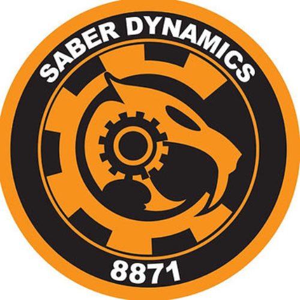

<h1 style="color: blue;"> What was it like before? </h1>

Prior to my position, the Instagram profile comfortably sat at around 130 followers. There wasn't any incentive from the advisor for the club for any growth on social media, but I thought otherwise. Having a high profile page could increase the chances of sponsors and other teams to recognize us. This is beneficial for the team because more sponsors mean we could participate in more regionals so we have a higher chance to go to the world stage or we could have more funding for the robot. 

<h1 style="color: blue;"> Methods I used for growth </h1>

One of the methods I used for growth is relatability. There wasn't really professional camerawork done for the shortform or even the longform content that I had to edit. The skits and memes me and my friend came up with was relatable to the viewer. For example, there were "daily" types of skits where I asked around what team members are most excited about for the current season or promotion for our Valentine's fundraiser. In order to get a wider reach, I also had to come up with something computer related but could cater to more people that don't really understand robotics that well. One of the members created a Milwaukee toolbox computer. I decided to use a trending audio at the time alongside showing off the computer.

<h1 style="color: blue;"> The aftermath </h1>

Regarding the Milwaukee toolbox video, it was our most viewed video coming in at 2.2 million views and 90k likes. It was one of the videos from the entire library that we had on the page that pushed us past 1,000 followers. Some notable followers include the most famous FRC teams as well as some local brands like Zippy's. Since these FRC teams followed us, we had the possibility to message them and have more networking options. 

Links: <a href="https://www.instagram.com/8871_saberdynamics/"><i class="? "></i>Instagram Page</a>
